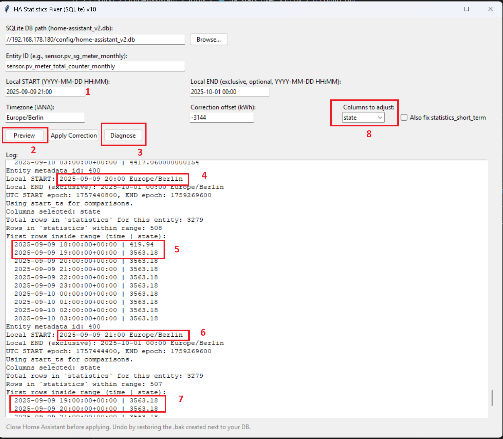
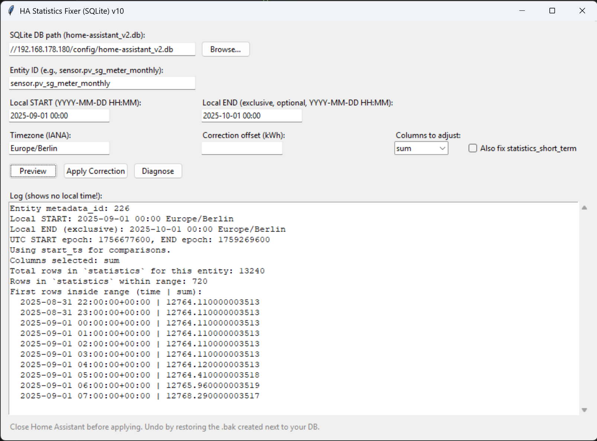

# 🧰 Home Assistant Statistics Fixer (SQLite)

# Contents
- [1. Deutsch](#1-Deutsch)
- [2. English](#2-English)
> 🇩🇪 Deutsch · 🇬🇧 English below

---
# 1. Deutsch
## 🇩🇪 Übersicht

**HA Statistics Fixer** ist ein Python-Tool mit GUI zur komfortablen Bearbeitung von Statistikdaten in **Home Assistant** (z. B. Energie- oder Zählerdaten).  
Fehlerhafte Modbus- oder Messwertausreißer können zu falschen Integralen oder Monatswerten führen – dieses Tool behebt das direkt in der SQLite-Datenbank (`home-assistant_v2.db`).

### ✨ Funktionen
- 🪟 **GUI (Tkinter)** – keine Kommandozeile nötig  
- 🕒 **Zeitfensterkorrektur:** Anfangs- und Endzeit (lokal oder UTC-basiert)  
- 📊 **Spaltenauswahl:** `sum`, `state` oder `both`  
- 🔎 **Diagnose & Vorschau:** zeigt Werte *vor, im und nach* dem gewählten Zeitraum  
- 💾 **Automatisches Backup** vor jeder Änderung  
- ⚙️ **Optional:** auch `statistics_short_term` anpassen  

---

## 🖥️ Installation

```bash
# 1. Python >= 3.10 erforderlich
python --version

# 2. Datei herunterladen
wget https://github.com/DrEvily/Home-Assistant-Statistics-Fixer/blob/main/ha_stats_fixer.py

# 3. (Optional) Abhängigkeiten sicherstellen
pip install tk zoneinfo

# 4. Tool starten
python ha_stats_fixer.py
```

---

## 🧩 Verwendung

1. **Home Assistant stoppen**, bevor du die Datenbank öffnest.  
2. In der GUI:
   - **DB-Pfad:** z. B. `/config/home-assistant_v2.db`
   - **Entity ID:** `sensor.pv_sg_meter_monthly`
   - **Startzeit:** `2025-09-01 00:00`
   - **Endzeit (optional, exklusiv):** `2025-10-01 00:00`
   - **Columns to adjust:** `state`, `sum` oder `both`
   - **Offset:** z. B. `-3000` (entfernt 3000 kWh)
3. **Preview** → Zeigt betroffene Zeilen  
4. **Diagnose** → Prüft Daten im Zeitraum  
5. **Apply Correction** → Änderungen ausführen  
6. **Home Assistant neu starten** und **Browsercache leeren**

---

## ⚠️ Sicherheit

- Das Tool erstellt **automatisch ein Backup**:  
  `home-assistant_v2.db.YYYYMMDD-HHMMSS.bak`  
- Während der Nutzung darf Home Assistant **nicht laufen!**  
- Rückgängig machen:
  ```bash
  cp home-assistant_v2.db.20251026-153000.bak home-assistant_v2.db
  ```

---

## 🧾 Beispiel
Innerhalb Home Assistant findet man zB im Verlauf heraus, dass die Variable sensor.pv_sg_meter_monthly unplausible Daten hat (meistens ein Sprung, zB durch Kommunikationsprobleme Modbus verursacht). Dadurch kann man meist Datum und Uhrzeit eingrenzen. Alternativ kann man auch Entwicklerwerkzeuge und Statistik nutzen um Ausreißer zu identifizieren.
- Eingabe der betroffenen Entität und des Datums/ Uhrzeit (1)
- Preview nutzen um die genaue Uhrzeit des Sprung (Offset von 3144) zu identifizieren (2)
- Diagnose kann optional auch genutzt werden um mehr Datenbankeinträge anzuzeigen (vor und nach dem Zeitstempel) (3)
- Bei 20Uhr (4) sieht man, dass die Daten zu diesem Zeitpunkt noch ok sind, der Sprung auf 3563kWh findet eine Stunde später statt (5)
- Setzt man in (1) 21Uhr, dann sieht man in (6) und (7) das ab diesem Zeitpunkt alle Daten einen Sprung haben 
- Da es sich bei der Entität um ein Utility-Meter/ Verbrauchszähler handelt müssen alle Daten in `state` (visualisierungsdaten zB für Statistikdiagramm) und `sum` (rohdaten) bis nächsten Monatsanfang in `Local END` (1. Oktober um 0Uhr) korrigiert werden. Tip: Über HA und dann Verlauf kann man gut erkennen, für welchen Zeitraum die Daten korrigiert werden müssen.



→ Nach Neustart zeigt das Diagramm den korrekten September-Wert.

---

## 📸 Screenshots

Home Asisstant's Statistics Tool Preview Output (gives quick overview if all atributes are found and how many entries are found)



Home Asisstant's Statistics Tool Details Output (allows betetr understanding of data due to detailed database entries output)


---

## 🧑‍💻 Autor & Lizenz
**Autor:** DrEvily  
**Lizenz:** MIT – Nutzung auf eigene Gefahr.

---

---
# 2. English
# 🇬🇧 Overview

**HA Statistics Fixer** is a Python GUI tool for editing **Home Assistant** statistical data (e.g. energy or meter readings) directly in the SQLite database.

Useful when occasional Modbus or sensor glitches produce unrealistic jumps that distort total or monthly values.

---

## ✨ Features
- 🪟 **Tkinter GUI** – no command line required  
- 🕒 **Time-window corrections:** start and optional end (local or UTC)  
- 📊 **Column selection:** `sum`, `state`, or `both`  
- 🔍 **Diagnosis & preview:** view values *before, inside, and after* your time range  
- 💾 **Automatic backup** before applying any changes  
- ⚙️ **Optional:** updates `statistics_short_term` as well  

---

## 🖥️ Installation

```bash
# 1. Requires Python >= 3.10
python --version

# 2. Download
wget https://github.com/DrEvily/Home-Assistant-Statistics-Fixer/blob/main/ha_stats_fixer.py

# 3. Ensure tkinter and zoneinfo are available
pip install tk zoneinfo

# 4. Run the app
python ha_stats_fixer.py
```

---

## 🧩 Usage

1. **Stop Home Assistant** before opening the database.  
2. Fill in:
   - **DB path:** `/config/home-assistant_v2.db`
   - **Entity ID:** e.g. `sensor.pv_sg_meter_monthly`
   - **Start time:** `2025-09-01 00:00`
   - **End time (optional, exclusive):** `2025-10-01 00:00`
   - **Columns to adjust:** `sum`, `state`, or `both`
   - **Offset:** e.g. `-3000`
3. Click **Preview** → review affected rows  
4. **Diagnose** → inspect surrounding data  
5. **Apply Correction** → changes with backup  
6. **Restart Home Assistant** + hard refresh UI  

---

## ⚠️ Safety Notes
- Automatically creates backups before every write:
  ```
  home-assistant_v2.db.YYYYMMDD-HHMMSS.bak
  ```
- Do **not** run Home Assistant during modification.  
- Restore from backup anytime:
  ```bash
  cp home-assistant_v2.db.20251026-153000.bak home-assistant_v2.db
  ```

---

## 🧾 Example

Within Home Assistant, you can find out via Recorder, for example, that the entity sensor.pv_sg_meter_monthly has implausible data (usually a jump, e.g., caused by Modbus communication problems). This usually allows you to narrow down the date and time. Alternatively, you can also use developer tools and statistics to identify outliers.
- Enter the affected entity and the date/time (1)
- Use the preview to identify the exact time of the jump (offset of 3144) (2)
- Diagnostics can also be used to display more database entries (before and after the timestamp) (3)
- At 8 p.m. (4), you can see that the data is still OK at this point in time; the jump to 3563kWh takes place an hour later (5)
- If you set (1) to 9 p.m., you can see in (6) and (7) that all data has a jump from this point in time 
- Since the entity is a utility meter/consumption meter, all data in `state` (visualization data, e.g., for statistical diagrams) and `sum` (raw data) must be corrected in `Local END` (October 1 at midnight) by the beginning of the next month. Tip: You can easily see the period for which the data needs to be corrected via HA and then History.


After restarting HA, the September bar will display correctly.


---

## 🧑‍💻 Author & License
**Author:** DrEvily
**License:** MIT  
Use at your own risk. Back up before modifying databases.
